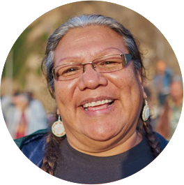
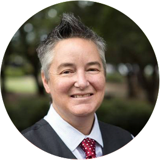
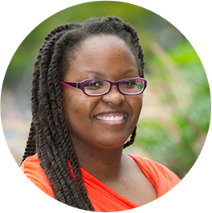

#### **Keynote Speakers Announced**

### **Opening Keynote,** <a href="http://www.speakoutnow.org/speaker/harden-lakota" target="_blank">Lakota Harden</a>, orator, activist, community organizer, workshop facilitator, radio host and poet.
 {.float_left} **Lakota Harden** 
(Minnecoujou/Yankton Lakota 
and HoChunk) is an orator, activist, community organizer, workshop facilitator, radio host and poet. She conducts trainings nationwide for adults who work with youth, across lines of gender, race and age to stop violence. As part of these projects, Harden conducts workshops on unlearning racism, sexism and other social oppressions. Her recent activism spans a range of issues, including solidarity efforts for the Idle No More movement, the South Dakota’s Indigenous Women's Network (IWN): Lakota Traditional Birthing Project, and work with OYATE, a Native organization working to see that the lives and histories of Native peoples are portrayed honestly through books. Harden is currently a host on the weekly radio program <a href="https://kpfa.org/program/bay-native-circle/">Bay Native Circle</a> on Pacifica radio station KPFA in the San Francisco Bay Area.

### **Closing Keynote,** <a href="http://chrisbourg.wordpress.com/about/" target="_blank">Chris Bourg</a>, Director of Libraries at Massachusetts Institute of Technology (MIT)

### with <a href="http://www.inthelibrarywiththeleadpipe.org/author/april-hathcock/" target="_blank">April Hathcock</a>, Scholarly Communications Librarian, New York University

 {.float_right} **Chris Bourg** is the Director of 
Libraries at Massachusetts Institute of Technology (MIT), where she also has oversight of the MIT Press. Prior to assuming her role at MIT, Chris worked for 12 years in the Stanford University Libraries, most recently as the Associate University Librarian for Public Services. 

Chris is keenly interested in issues of diversity and inclusion in higher education; and in the role libraries play in advancing social justice and democracy. She is currently serving as Chair of the Committee on Diversity and Inclusion of the Association of Research Libraries and has written and spoken extensively on diversity, inclusion, and leadership.

Chris has a PhD in Sociology from Stanford University, and spent 10 years as an active duty U.S. Army officer, including 3 years on the faculty at the United States Military Academy at West Point. 

 {.float_left} 
**April Hathcock** is the Scholarly Communications Librarian at New York University where she educates the campus community on issues of ownership, access, and rights in the research lifecycle. Before entering librarianship, she practiced intellectual property and antitrust law for a global private firm. Her research interests include intellectual property and marginalized communities and diversity and inclusion in librarianship.

Her recent publications include _"White Librarianship in Blackface: Diversity Initiatives in LIS."_